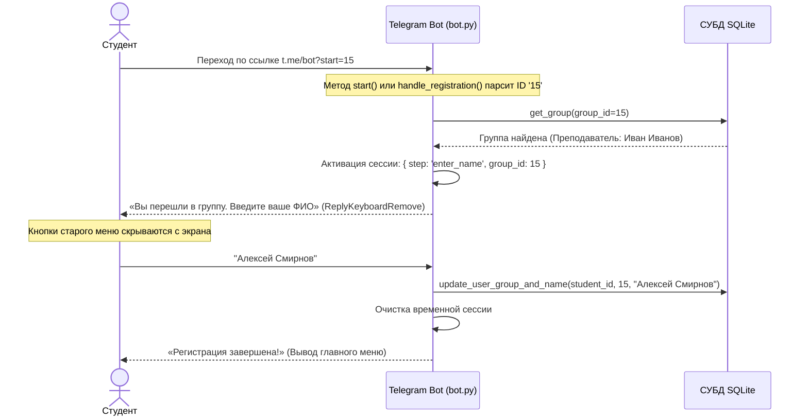
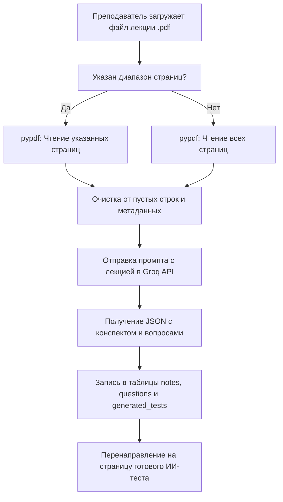

# Документация проекта StudyPack AI: Полное техническое руководство

StudyPack AI (также известный как *StudyBot AI*) — это мультиарендная (multi-tenant) цифровая образовательная платформа. Данный документ содержит детальное руководство по архитектуре, схеме базы данных, бэкенд-модулям, фронтенд-интерфейсам и конфигурационным файлам системы.

---

## 1. Архитектура и стек технологий

Архитектура системы разделена на три логических слоя (3-Tier Architecture):

```
              ┌─────────────────────────────────────────┐
              │          Клиентские интерфейсы          │
              │  (Telegram-бот / Браузер преподавателя) │
              └────────────────────┬────────────────────┘
                                   │ HTTPS
                                   ▼
              ┌─────────────────────────────────────────┐
              │           Сервер приложений             │
              │         (Flask / aiogram / ИИ)          │
              └────────────────────┬────────────────────┘
                                   │ SQL (Local Connection)
                                   ▼
              ┌─────────────────────────────────────────┐
              │             Слой данных                 │
              │             (SQLite 3)                  │
              └─────────────────────────────────────────┘
```

> [!NOTE]
> Слой представления полностью разделен: студенты взаимодействуют с асинхронным Telegram-ботом, в то время как преподаватели используют адаптивную веб-панель для создания тестов и мониторинга успеваемости.

### Спецификация используемых технологий:

| Компонент | Технология | Назначение в проекте |
| :--- | :--- | :--- |
| **Язык разработки** | `Python 3.10+` | Основная логика, парсинг документов, обработка API |
| **Веб-сервер** | `Flask 3.0.3` | Веб-интерфейс преподавателя, управление сессиями и маршрутизация |
| **Telegram Engine** | `Aiogram 3.13.1` | Асинхронный бот для прохождения тестов студентами |
| **СУБД** | `SQLite 3` | Хранение изолированных данных групп, пользователей и логов |
| **Интеграция ИИ** | `Groq API` | Модель `llama-3.3-70b-versatile` для генерации тестов и конспектов |
| **Парсинг файлов** | `PyPDF` | Бинарное чтение и постраничное извлечение текста лекций |
| **Верификация** | `SMTP` | Отправка одноразовых кодов регистрации на почту преподавателя |

---

## 2. Проектирование базы данных (Database Schema)

База данных SQLite (`data/studybot_ai.db`) использует реляционную модель со строгой каскадной целостностью.

```mermaid
erDiagram
    TEACHERS ||--o{ GROUPS : "создает и управляет"
    GROUPS ||--o{ USERS : "содержит студентов (SET NULL)"
    GROUPS ||--o{ SUBJECTS : "содержит предметы (CASCADE)"
    SUBJECTS ||--o{ QUESTIONS : "имеет вопросы (CASCADE)"
    SUBJECTS ||--o{ NOTES : "имеет конспекты (CASCADE)"
    SUBJECTS ||--o{ GENERATED_TESTS : "логирует ИИ-тесты (CASCADE)"
    USERS ||--o{ RESULTS : "получает оценки (CASCADE)"
    SUBJECTS ||--o{ RESULTS : "включает тесты (CASCADE)"

    TEACHERS {
        int id PK "Идентификатор преподавателя"
        string email UNIQUE "Электронная почта"
        string password_hash "Хеш пароля (PBKDF2/SHA-256)"
        string full_name "Имя и фамилия преподавателя"
        string created_at "Дата регистрации"
    }
    GROUPS {
        int id PK "Идентификатор группы"
        string name "Название группы (например, 2509)"
        int teacher_id FK "Ссылка на преподавателя"
        string created_at "Дата создания"
    }
    USERS {
        int id PK "Уникальный ID студента в системе"
        int telegram_id UNIQUE "Telegram ID пользователя"
        string username "Юзернейм в Telegram"
        string full_name "Реальное ФИО студента"
        int group_id FK "Ссылка на группу"
        string created_at "Дата онбординга"
    }
```

### Детальное описание таблиц:

1. **`teachers` (Преподаватели):**
   - `id`: Первичный ключ с автоинкрементом.
   - `email`: Уникальный адрес электронной почты преподавателя (используется для авторизации).
   - `password_hash`: Безопасный хеш пароля, сгенерированный с помощью `werkzeug.security`.
   - `full_name`: Имя и фамилия преподавателя, которые будут отображаться студентам в Telegram при выборе групп.
   - `created_at`: Таймштамп регистрации в формате ISO.

2. **`groups` (Учебные группы):**
   - `id`: Первичный ключ.
   - `name`: Название группы (например, "Информатика-1", "Математика-Основы").
   - `teacher_id`: Внешний ключ, связывающий группу с её создателем.
   - `UNIQUE(name, teacher_id)`: Гарантирует уникальность имени группы в рамках одного преподавателя.

3. **`users` (Студенты):**
   - `telegram_id`: Уникальный идентификатор пользователя из Telegram API.
   - `full_name`: Реальное ФИО студента, вводимое при первом входе.
   - `group_id`: Ссылка на текущую группу студента. При удалении группы поле сбрасывается в `NULL` (`ON DELETE SET NULL`), что позволяет студенту повторно войти в другую группу.

4. **`subjects` (Учебные предметы):**
   - Привязаны к конкретным группам (`group_id`). Удаление группы каскадно удаляет все её предметы (`ON DELETE CASCADE`).

5. **`questions` (Вопросы тестов):**
   - Содержат текст вопроса, 4 варианта ответов (A, B, C, D) и правильную букву ответа. Привязаны к предметам.

6. **`notes` (Конспекты):**
   - Хранят заголовки и текстовое содержание конспектов лекций, созданных ИИ.

7. **`results` (Результаты тестов):**
   - Фиксируют количество правильных ответов студентов по каждому тесту для вывода статистики.

8. **`generated_tests` (Логи генерации ИИ):**
   - Хранят исходный материал, полученный ИИ-конспект и сгенерированный JSON-массив вопросов для архива преподавателя.

---

## 3. Детальный разбор исходного кода по файлам

### 3.1. Пакет `studybot_ai/`

#### ⚙️ [config.py](file:///c:/Users/user/Desktop/Coding/Projects/Practice/Studybot%20with%20AI/studybot_ai/config.py)
Модуль обеспечивает безопасную загрузку секретных переменных окружения.
- **Основные функции:**
  - `load_environment() -> None`: Ищет файл `.env` в корне проекта и загружает переменные в системное окружение `os.environ` с помощью библиотеки `python-dotenv`.
  - `get_required_env(name: str) -> str`: Запрашивает обязательную переменную (например, `BOT_TOKEN` или `GROQ_API_KEY`). Если значение отсутствует, выбрасывает исключение `RuntimeError`, прекращая выполнение программы.
  - `get_env(name: str, default: str) -> str`: Безопасно извлекает переменную с возможностью подстановки значения по умолчанию.

#### 🗄️ [database.py](file:///c:/Users/user/Desktop/Coding/Projects/Practice/Studybot%20with%20AI/studybot_ai/database.py)
Слой работы с СУБД SQLite. Реализует паттерн «контекстного менеджера» для управления транзакциями и авто-закрытия соединений.
- **Ключевые функции:**
  - `get_connection()`: Контекстный менеджер. Включает поддержку внешних ключей через команду `PRAGMA foreign_keys = ON` и устанавливает `row_factory` для возврата результатов в виде словарей.
  - `init_db()`: Выполняет SQL-скрипт создания всех таблиц. Дополнительно проверяет наличие колонки `full_name` в таблице `teachers` и при её отсутствии делает `ALTER TABLE` (динамическая миграция).
  - `create_teacher(email, password_hash, full_name)`: Сохраняет аккаунт преподавателя.
  - `list_all_groups()`: Выполняет JOIN таблиц `groups` и `teachers` для получения списка групп вместе с именами их преподавателей.
  - `update_user_group_and_name(telegram_id, group_id, full_name)`: Записывает ФИО и группу студента в базу данных.
  - `clear_user_group(telegram_id)`: Сбрасывает привязку к группе при выходе.

#### 🤖 [ai_client.py](file:///c:/Users/user/Desktop/Coding/Projects/Practice/Studybot%20with%20AI/studybot_ai/ai_client.py)
Интерфейс общения с Groq Cloud API. Отвечает за генерацию учебных материалов с помощью модели Llama 3.3.
- **Основные функции:**
  - `generate_study_pack(subject_name, material, question_count)`: Формирует системный промпт (System Prompt), требующий от ИИ вернуть строго структурированный JSON-ответ. Устанавливает параметр `temperature = 0.3` для минимизации галлюцинаций модели и заставляет её оперировать только фактами из предоставленного текста лекции.
- **Формат промпта требует JSON с полями:**
  - `note_title` — заголовок конспекта.
  - `note_content` — краткое структурированное изложение материала.
  - `questions` — массив вопросов, каждый из которых содержит `question`, `option_a`, `option_b`, `option_c`, `option_d` и `correct_answer` (одна из букв A, B, C, D).

#### 🌐 [admin.py](file:///c:/Users/user/Desktop/Coding/Projects/Practice/Studybot%20with%20AI/studybot_ai/admin.py)
Маршрутизатор Flask-приложения для личного кабинета преподавателя.
- **Основные компоненты и декораторы:**
  - `login_required(f)`: Декоратор, перенаправляющий неавторизованных пользователей на `/login`.
  - `group_required(f)`: Декоратор, требующий выбора активной учебной группы перед переходом к генерации тестов.
  - `inject_user_context()`: Контекст-процессор Flask. Динамически делает HTTPS-запрос к Telegram API (`getMe`), чтобы получить юзернейм бота для генерации инвайт-ссылок.
  - `_read_material_from_request(...)`: Парсит файлы лекций. Извлекает текст из `.txt`, `.md` или вырезает конкретный диапазон страниц из файлов `.pdf` без сохранения их на жесткий диск (в оперативной памяти через `io.BytesIO` и `pypdf.PdfReader`).
- **Маршруты:**
  - `/register` и `/verify`: Двухэтапная регистрация преподавателя. На почту высылается 6-значный код верификации (через SMTP-сервер). Дополнительно код выводится в лог терминала.
  - `/groups`, `/groups/create`, `/groups/<id>/delete`: Управление группами преподавателя.
  - `/new-test`: Панель добавления предметов, генерации тестов через ИИ и просмотра студентов активной группы.
  - `/generate-test`: Отправляет лекцию в Groq API, сохраняет сгенерированный конспект и вопросы в БД.

#### 💬 [bot.py](file:///c:/Users/user/Desktop/Coding/Projects/Practice/Studybot%20with%20AI/studybot_ai/bot.py)
Асинхронный Telegram-бот на фреймворке `aiogram` для взаимодействия со студентами.
- **Основные обработчики (Handlers):**
  - `check_not_registered(message)`: Фильтр, проверяющий, привязан ли студент к существующей группе. Если группа была удалена преподавателем в админке, фильтр сбрасывает состояние студента в базе данных и запускает процесс выбора новой группы.
  - `handle_registration(message)`: Обрабатывает реферальный запуск бота `/start <group_id>` (Deep Linking). Если передан ID группы, бот сразу переходит к шагу запроса ФИО студента. Если студент регистрируется вручную, бот выводит клавиатуру со списком всех групп и ФИО их преподавателей. Во время ввода текста клавиатура меню скрывается с помощью `ReplyKeyboardRemove`.
  - `start_quiz(call)`: Извлекает 10 случайных вопросов по предмету из базы данных и запускает сессию тестирования.
  - `answer_question(call)`: Фиксирует ответ студента (A, B, C или D), ведет подсчет баллов и по завершении теста сохраняет результат в таблицу `results`.
  - `show_stats(message)`: Отображает количество пройденных тестов, средний и лучший процент успеваемости студента.

---

## 4. Схемы жизненных циклов системы (Flowcharts)

### 4.1. Схема онбординга по ссылке-приглашению (Deep Linking)



### 4.2. Схема ИИ-обработки лекций и PDF-документов


